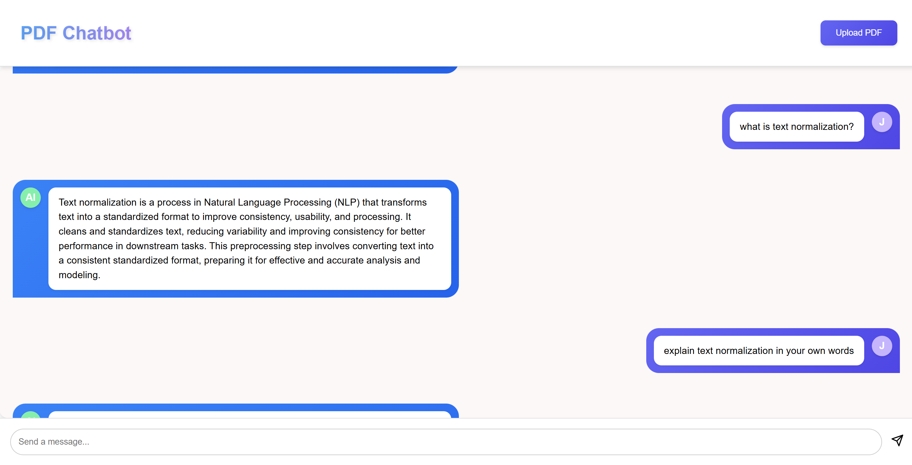

# 📄 PDF Chatbot (FastAPI + React)

This project enables users to **upload PDFs** and **interact** with the document content through an elegant **chat interface**, powered by Google's Gemini AI.




## 🌟 Core Features
* Upload and process PDF documents
* Interactive Q&A with document content
* Semantic search for relevant context
* Modern, gradient-themed UI
* Real-time chat experience

## 🛠️ Tech Stack

### Frontend
- React + Vite
- Modern CSS with gradient themes
- Fetch API for backend communication

### Backend
- FastAPI (Python)
- Sentence Transformers for semantic search
- Google Gemini AI for question answering
- PyMuPDF for PDF processing

## 📦 Project Structure

```
pdfReader/
├── backend/
│   ├── app/
│   │   └── utils/
│   │       ├── pdf_utils.py
│   │       └── qa_engine.py
│   ├── main.py
│   └── requirements.txt
│
├── pdf-qa-frontend/
│   ├── src/
│   │   ├── components/
│   │   │   ├── Chat.jsx
│   │   │   ├── ChatBubble.jsx
│   │   │   ├── FileUpload.jsx
│   │   │   ├── Header.jsx
│   │   │   └── MessageInput.jsx
│   │   ├── App.jsx
│   │   └── main.jsx
│   └── package.json
```

## 🚀 Setup Instructions

### Backend Setup

```bash
cd backend
python -m venv venv
venv\Scripts\activate  # Windows
pip install -r requirements.txt

# Set up environment variables
# Create .env file with:
GOOGLE_API_KEY=your_gemini_api_key

# Start server
uvicorn main:app --reload
```

### Frontend Setup

```bash
cd pdf-qa-frontend
npm install
npm run dev
```

## 🧠 How It Works

1. **PDF Upload**: User uploads PDF through modern UI
2. **Text Processing**: 
   - Backend extracts text using PyMuPDF
   - Text is processed for semantic search

3. **Question Answering**:
   - Uses Sentence Transformers to find relevant context
   - Gemini AI generates accurate answers
   - Real-time chat interface updates

## 🎨 UI Features
- Gradient-themed components
- Smooth animations
- Responsive design
- Custom scrollbars
- Modern chat bubbles

## 🛡️ License
MIT License - Feel free to use and modify!

## 🤝 Contributing
Contributions welcome! Please feel free to submit pull requests.
